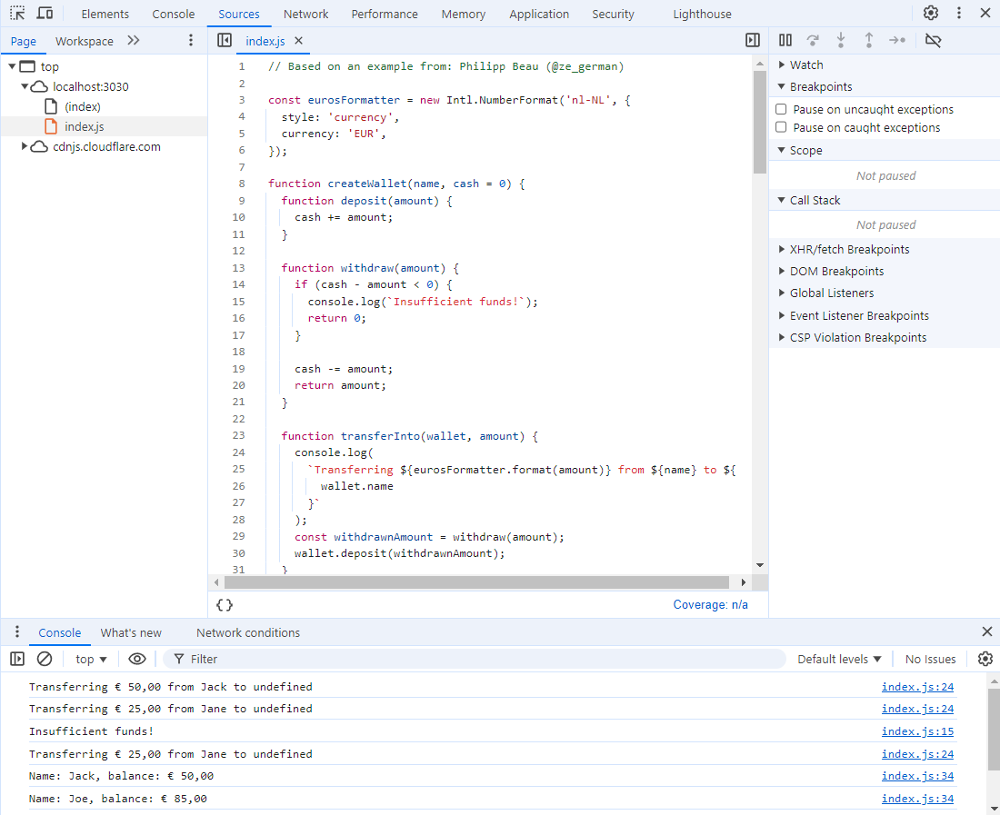
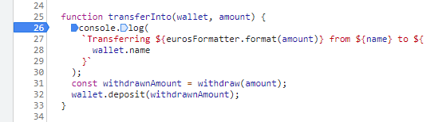
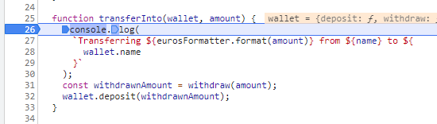
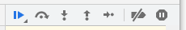

# Homework Javascript Week 4

## Exercises

The homework for this week can be found in the `homework` folder.

### Exercise 1: The odd ones out

**File:** `ex1-doubleEvenNumbers.js`

Look at the following code snippet:

```js
function doubleEvenNumbers(numbers) {
  const newNumbers = [];
  for (let i = 0; i < numbers.length; i++) {
    if (numbers[i] % 2 === 0) {
      newNumbers.push(numbers[i] * 2);
    }
  }
  return newNumbers;
}

const myNumbers = [1, 2, 3, 4];
console.log(doubleEvenNumbers(myNumbers)); // Logs "[4, 8]" to the console
```

The `doubleEvenNumbers` function returns only the even numbers in the array `myNumbers` and doubles them. While this code works as advertised we would like to use a more _functional_ approach.

Let's rewrite it (or _refactor_ it, as professional developers would call it):

- Using the `map` and `filter` functions, rewrite the function body of `doubleEvenNumbers`.

### Exercise 3: What's your Monday worth?

**File:** `ex3-mondaysWorth.js`

When you're a developer at a big company your Monday could look something like this:

```js
const mondayTasks = [
  {
    name: 'Daily standup',
    duration: 30, // specified in minutes
  },
  {
    name: 'Feature discussion',
    duration: 120,
  },
  {
    name: 'Development time',
    duration: 240,
  },
  {
    name: 'Talk to different members from the product team',
    duration: 60,
  },
];
```

Let's assume your hourly rate is €25. How much would you earn on that day?

- Complete the function names `computeEarnings`. It should take an array of tasks and an hourly rate as arguments and return a formatted Euro amount (e.g: `€11.34`) comprising the total earnings.
- Use the `map` array function to take out the duration time for each task.
- Multiply each duration by a hourly rate for billing and sum it all up.
- Make sure the program can be used on any array of objects that contain a `duration` property with a number value.

### Exercise 4: Publish and Subscribe

**File:** `ex4-publishSubscribe.js`

A software pattern that you may encounter in the future is a construct called the **Observer Pattern**. It enables **listeners** (which are usually functions) to **subscribe** to **notifications** from a **publisher**. Any number of listeners can subscribe.

Consider the code below (from `ex4-publishSubscribe.js`):

- The call to the `createPublisher` function returns an object. For ease of reference, let's call it a **Publisher** object here. The **Publisher** object has two properties, `subscribe` and `notify`, which are both functions. In this exercise you are required to complete them. (But continue reading first.)

- As you can see below, the `createPublisher` function is called and the resulting Publisher object is assigned to the `myPublisher` variable.

- Next, two **listener** functions are defined, notably `consoleUpperCase` and `consoleLowerCase`. A listener function is defined here as a function that takes a single parameter, `message`. It is up to the listener what to do with `message`. (The **Publisher** has no say in this!).

- The **listener** functions are added as **subscribers** to `myPublisher` by calling its `subscribe` function. The `subscribe` function should take the function passed to it as an argument and push it onto the `listeners` array. (Yes, you can store functions in an array. Functions are treated in JavaScript like any other value. See [First-class Function](https://developer.mozilla.org/en-US/docs/Glossary/First-class_Function) in MDN Web Docs.)

- The standard `console.log` function, which also conforms to the minimum requirement for a **listener** (although it can take more than one argument) is also added as a subscriber.

- Finally, a call to the Publisher's `notify` function is expected to iterate through, and call, all subscribers from the `listeners` array, relaying the notification message to each listener.

Good luck with completing `createPublisher`!

```js
function createPublisher() {
  const listeners = [];
  return {
    subscribe: function (/* TODO parameter(s) go here */) {
      // TODO complete this function
    },
    notify: function (/* TODO parameter(s) go here */) {
      // TODO complete this function
    },
  };
}

const myPublisher = createPublisher();

function consoleUpperCase(message) {
  console.log(message.toUpperCase());
}

function consoleLowerCase(message) {
  console.log(message.toLowerCase());
}

myPublisher.subscribe(consoleUpperCase);
myPublisher.subscribe(consoleLowerCase);
myPublisher.subscribe(console.log);

myPublisher.notify("Let's see what happens here!");
// Print the following to the console
// "LET'S SEE WHAT HAPPENS HERE!"
// "let's see what happens here!"
// "Let's see what happens here!"
```

### Exercise 5: Transfer into Wallet

#### Folder: `ex5-wallet`

In this exercise we will practice using the Chrome debugger. Other browsers, such as FireFox, Edge and Safari have similar tools but the exact look and feel may be different.

At the end of the `index.js` file of the exercise is a `quiz` object with multiple-choice questions that we would like you to complete as you follow along the instructions below.

> For a general tutorial on how to use the Chrome debugger see: [The definitive guide to JavaScript Debugging [2021 Edition]](https://dev.to/atapas/the-definitive-guide-to-javascript-debugging-2021-edition-116n).

Here is a listing of the code in `index.js` (minus the `quiz` object) we will be working with:

```js
const eurosFormatter = new Intl.NumberFormat('nl-NL', {
  style: 'currency',
  currency: 'EUR',
});

function createWallet(name, cash = 0) {
  function deposit(amount) {
    cash += amount;
  }

  function withdraw(amount) {
    if (cash - amount < 0) {
      console.log(`Insufficient funds!`);
      return 0;
    }

    cash -= amount;
    return amount;
  }

  function transferInto(wallet, amount) {
    console.log(
      `Transferring ${eurosFormatter.format(amount)} from ${name} to ${
        wallet.name
      }`
    );
    const withdrawnAmount = withdraw(amount);
    wallet.deposit(withdrawnAmount);
  }

  function reportBalance() {
    console.log(`Name: ${name}, balance: ${eurosFormatter.format(cash)}`);
  }

  const getName = () => name;

  return {
    deposit,
    withdraw,
    transferInto,
    reportBalance,
    getName,
  };
}

const walletJack = createWallet('Jack', 100);
const walletJoe = createWallet('Joe', 10);
const walletJane = createWallet('Jane', 20);

walletJack.transferInto(walletJoe, 50);
walletJane.transferInto(walletJoe, 25);

walletJane.deposit(20);
walletJane.transferInto(walletJoe, 25);

walletJack.reportBalance();
walletJoe.reportBalance();
walletJane.reportBalance();
```

Since this is a browser-based exercise, the file `index.js` will be loaded via a `<script>` tag in `index.html`. The `index.html` file itself requires no further consideration here.

Let's run the exercise using our convenience command `npm run it`:

```console
❯ npm run it

> javascript@1.0.0 it C:\Users\jimcr\dev\hackyourfuture\homework
> node ./test-runner/run-it

? Rerun last test (1-Javascript, Week4, ex5-wallet)? No
? Which module? 1-Javascript
? Which week? Week4
? Which exercise? ex5-wallet
Running exercise, please wait...
HTTP server running at http://localhost:3030
Press Ctrl-C to exit.
```

This will run the exercise in the default browser (if your default browser is not Chrome then open this URL manually in Chrome: `http://locahost:3030`).

Next, open the Developer Tools by pressing function key <kbd>F12</kbd> and examine the console output. It will look like this:

```console
Transferring € 50,00 from Jack to undefined
Transferring € 25,00 from Jane to undefined
Insufficient funds!
Transferring € 25,00 from Jane to undefined
Name: Jack, balance: € 50,00
Name: Joe, balance: € 85,00
Name: Jane, balance: € 15,00
```

We seem to have a bug because we get `undefined` where we expect a name.

Open the **Sources** panel from Developer Tools. Select `index.js` from the explorer panel and make sure that the console output is visible in the bottom panel, as shown in Figure 1.

> 
>
> Figure 1. The Chrome Developer Tools Debugger.

First let's examine what causes the `undefined` value in the message. The `console.log` that outputs that message starts on line 26. We would like to inspect the state of the program when the execution reaches that point. For that purpose we will place a **breakpoint** at line 26. A breakpoint is a location in our code where we would like the JavaScript engine to pause execution when we run the program with the debugger.

To place a breakpoint at line 26, click to the left of the number 26 in the left margin of the editor window. A blue marker will appear to indicate the presence of a breakpoint (Figure 2):

> 
>
> Figure 2. Breakpoint placed at line 26.

With this breakpoint set, reload the page to rerun the JavaScript code. The execution will be paused at line 26, as indicated by the blue highlighting of that line:

> 
>
> Figure 3. Breakpoint at line 26 is hit.

To the right of the code panel you can inspect, amongst others, **Breakpoints**, **Scope** and the **Call Stack**.

:question: Please answer questions **q1** and **q2** in the `quiz` object.

When we expand the variable `wallet` in the local scope of the Scope panel, we can see that it contains the following properties (all functions):

- `deposit`
- `getName`
- `reportBalance`
- `transferInto`
- `withdraw`

There is no `name` property there. That must be the reason why we get `undefined` when we try to access `wallet.name`. Let's examine this by instructing the debugger to step over (i.e. execute) the `console.log` function call. Figure 4 below shows the debug buttons located near the upper right corner of the Developer Tools.

> 
>
> Figure 4. Developer Tools debug buttons

Hover the mouse over each of these buttons in the browser and take note of the tooltips that appear.

:question: Please answer question **q3** of the `quiz` object.

Press the button **Stepping over next function call**. As you can see the execution is now stopped at line 31. The whole function call, which spanned (due to Prettier) four lines is executed and stepped over. If we examine the console at the bottom of the screen we can see that the variable `name` was displayed correctly, but `wallet.name` was undefined. As we saw earlier in the Scope panel, a `wallet` object doesn't include a `name` property.

The `name` variable, as well as the `cash` variable are deliberately made _private_ to each instance of a `wallet` object, by means of a _closure_. We don't want to give external code the ability to change the name of the wallet owner or change its cash amount. However, we _do_ want to give some form of **read-only** access to these variables. For this purpose the `wallet` object provides two functions, `reportBalance()` and `getName()`, that _do_ have access to the "_closed-in_" variables (or actually, in this case, _parameters_) `name` and `cash`. We can therefore fix the `undefined` bug by replacing `wallet.name` with `wallet.getName()`.

Let's try and make that change in the VSCode editor window. Prettier will probably now cause the `console.log` call to span five lines.

Now, with the breakpoint still set at line 26, reload the page (first click the large X to cancel loading the current page and then the reload button to reload the page). Then, step over the `console.log` and inspect the console.

:question: Please answer question **q4** of the quiz object.

With execution paused at (now) line 31, press the **Step into next function call** button. If all is well that should take us into the function `withdraw()`, which is being called from line 31. If you hover your mouse over the variables `cash` and `amount` on line 31 you can peek at their current values, respectively `100` and `50`: that should be sufficient to make the withdrawal successful.

Let's add a breakpoint at line 17. That breakpoint will only be hit in the case of insufficient funds. Press the button **Step over next function call**. What is being stepped over here is not a function call but a statement. So maybe this button is better labelled "Step over next statement"... But we will have to make do with what we got.

In any case, the `console.log` of line 17 was not executed, as we expected.

With the `undefined` problem solved, we would now like to examine the instances where we get the message `Insufficient funds!`. The breakpoint at line 17 is perfect for that. But we no longer need the breakpoint at line 26. Click on that breakpoint in the left margin of the editor window to remove it again.

Now, let's resume execution of the code by pressing the button **Resume script execution**. Our breakpoint at line 17 will be hit. Inspect the Scope panel to determine the name of the owner of the wallet that has insufficient funds.

:question: Please answer question **q5** of the `quiz` object.

Press the **Resume script execution** again. The program will now run to completion without issues. This also completes this exercise.
