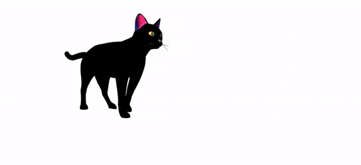

# Assignment Browsers Week 1

## Deliverable Exercises

The assignment for this week can be found in the `assignment` folder.

> :collision: **Important**
>
> In this assignment you are not allowed to use `.innerHTML`. To create HTML elements, use `document.createElement()`. To set the text content of an element, use `.textContent`. The assignment tests currently do not support `.innerText`.

## Exercise 1: The book list

**Folder**: `ex1-bookList`

I'd like to display my three favorite books inside a nice webpage!

```js
const myBooks = [
  {
    title: 'The Design of Everyday Things',
    author: 'Don Norman',
    isbn: '978-0465050659',
    alreadyRead: false,
  },
  {
    title: 'The Most Human Human',
    author: 'Brian Christian',
    isbn: '978-1617933431',
    alreadyRead: true,
  },
  {
    title: 'The Pragmatic Programmer',
    author: 'Andrew Hunt',
    isbn: '978-0201616224',
    alreadyRead: true,
  },
];
```

1. Iterate through the array of books.
2. For each book, create a `<p>` element with the book `title` and `author`.
3. Use a `<ul>` and `<li>` to display the books.
4. Add an `` to each book that links to a URL of the book cover.
5. Change the style of the book depending on whether you have read it (green) or not (red).

The end result should look something like [this](https://hackyourfuture.github.io/example-pages/Browsers/Week1/1-booklist/)

## Exercise 2: About me

**Folder**: `ex2-aboutMe`

Given this HTML:

```html
<!doctype html>
<html lang="en">
  <head>
    <meta charset="UTF-8" />
    <meta name="viewport" content="width=device-width, initial-scale=1.0" />
    <title>Document</title>
    <link href="./style.css" rel="stylesheet" />
  </head>
  <body>
    <h1>About Me</h1>
    <ul>
      <li>Nickname: <span id="nickname"></span></li>
      <li>Favorite food: <span id="fav-food"></span></li>
      <li>Hometown: <span id="hometown"></span></li>
    </ul>
    <script src="index.js"></script>
  </body>
</html>
```

1. Using JavaScript, replace each of the spans (`nickname`, `fav-food`,`hometown`) with your own information.
2. In JavaScript, iterate through each `<li>` and change the class to `list-item`.
3. Inside the CSS file, add a style tag that sets a rule for `.list-item` to make the color red. Do this manually (i.e., not with JavaScript).

## Exercise 3: The logo hijack

**File**: `ex3-hijackLogo.js`

No homepage is safe from the logo bandit! Every time he sees a Google Logo he replaces it with a logo from HackYourFuture instead: <https://github.com/HackYourFuture/Assignments/tree/main/assets/hyf-logo-black-bg-small.png>.

In this exercise you're expected to write a JavaScript function that can be executed in the console of the [Google website](https://www.google.com).

1. Find out how to select the element that contains the Google logo, and store it in a variable.
2. Modify the `.src` and `.srcset` properties of the logo so that it's replaced by the HackYourFuture logo instead.

## Exercise 4: What's the time?

**Folder**: `ex4-whatsTheTime`

Why wear a watch when you can check the time, live in your webpage?

1. Inside the `index.js`, complete the `addCurrentTime` to add the current time to the webpage. Make sure it's written in the HH:MM:SS notation (hour, minute, second). Log the current time to the console also. Use `setInterval()` to make sure the time stays up to date.
2. Have the function execute when the browser has finished loading the page.
3. Verify that the current time is displayed correctly on both the web page and the browser's console.

## Exercise 5: The cat walk

**Folder**: `ex5-catWalk`

Start with this webpage, which has a single img tag of an animated GIF of a cat walking.

```html
<!doctype html>
<html lang="en">
  <head>
    <meta charset="UTF-8" />
    <meta name="viewport" content="width=device-width, initial-scale=1.0" />
    <title>Cat Walk</title>
    <style>
      img {
        position: absolute;
      }
    </style>
  </head>
  <body>
    
    <script src="index.js"></script>
  </body>
</html>
```

1. Create a variable to store a reference to the `` element.
2. Change the style of the `` to have a `left` of `0px`, so that it starts at the left hand of the screen.
3. Complete the function called catWalk() to move the cat 10 pixels to the right of where it started, by changing the `left` style property.
4. Call that function every 50 milliseconds. Your cat should now be moving across the screen from left to right. Hurrah!
5. When the cat reaches the right-hand of the screen, restart them at the left hand side (`0px`). So they should keep walking from left to right across the screen, forever and ever.
6. Each time when the cat reaches the middle of the screen, replace the img with an image of a cat dancing (use this URL: <https://media1.tenor.com/images/2de63e950fb254920054f9bd081e8157/tenor.gif>), keep it dancing for 5 seconds, and then replace the img with the original image and have it continue the walk.

This is what it should like:



_Have fun!_
