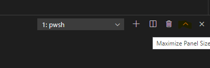
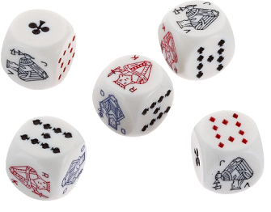

# Homework Using APIs Week 1

## Exercises

The homework for this week can be found in the `homework` folder.

### Exercise 1: John who?

### File: `ex1-johnWho.js`

Take a look at the following function (and try it out in your console):

```js
const getAnonName = (firstName, callback) => {
  setTimeout(() => {
    if (!firstName) {
      callback(new Error("You didn't pass in a first name!"));
      return;
    }

    const fullName = `${firstName} Doe`;

    callback(fullName);
  }, 1000);
};

getAnonName('John', console.log);
```

Rewrite this function, but replace the callback syntax with the Promise syntax:

- Have the `getAnonName` arrow function return a `new Promise`.
- If the Promise resolves, pass the full name as an argument to `resolve()`.
- If the Promise rejects, pass an `Error` object containing "You didn't pass in a first name!" to `reject()`.

### Exercise 2: Is it a double digit number?

#### File: `checkDoubleDigits.js`

Complete the function called `checkDoubleDigits` such that:

- It takes one argument: a number
- It returns a `new Promise`.
- If the number is between 10 and 99 it should resolve to the string "This is double digit number!".
- For any other number it should reject with an an Error object containing: "Expected a double digit number but got `number`", where `number` is the number that was passed as an argument.

### Exercise 3: Roll a die

### File `ex3-rollDie.js`

This exercise is about throwing a die. A die in this exercise may roll up to 10 times before it settles on a final value, depending on the "force" with which it is thrown. Unfortunately, if a die rolls more than six times in our game it rolls off the table and the throw becomes invalid. If it rolls six times or less, its final (_"settled"_) value will be valid.

> Note: to keep things simple, we have taken some liberties in this exercise with respect to how a die behaves in reality. For instance, in real life a die cannot flip back to a value it previously had. And it will mostly roll on its corners, not its sides.

The existing `rollDie()` function in the exercise file uses a callback to notify the caller of success or failure. Here is the code:

```js
function rollDie(callback) {
  // Compute a random number of rolls (3-10) that the die MUST complete
  const randomRollsToDo = Math.floor(Math.random() * 8) + 3;
  console.log(`Die scheduled for ${randomRollsToDo} rolls...`);

  const rollOnce = (roll) => {
    // Compute a random die value for the current roll
    const value = Math.floor(Math.random() * 6) + 1;
    console.log(`Die value is now: ${value}`);

    // Use callback to notify that the die rolled off the table after 6 rolls
    if (roll > 6) {
      // TODO replace "error" callback
      callback(new Error('Oops... Die rolled off the table.'));
    }

    // Use callback to communicate the final die value once finished rolling
    if (roll === randomRollsToDo) {
      // TODO replace "success" callback
      callback(null, value);
    }

    // Schedule the next roll todo until no more rolls to do
    if (roll < randomRollsToDo) {
      setTimeout(() => rollOnce(roll + 1), 500);
    }
  };

  // Start the initial roll
  rollOnce(1);
}

function main() {
  // TODO Refactor to use promise
  rollDie((error, value) => {
    if (error !== null) {
      console.log(error.message);
    } else {
      console.log(`Success! Die settled on ${value}.`);
    }
  });
}
```

> A couple of comments about this code:
>
> - In real life, a die, when thrown, will autonomously run its course until it comes to a complete standstill, abiding the laws of nature. How long it will roll depends on the force of the throw. In our simulation that "force" is represented by the random value assigned to `randomRollsToDo`. As if subjected to the laws of nature, we insist that our simulated dice continue to roll until they have reached their randomly assigned number of rolls-to-do, even after dropping of the table.
> - The "error first" callback format used in this example, using two parameters, is commonly used in Node.js. To communicate back _failure_, the callback is called with a _single_ argument: the error value (usually a JavaScript `Error` object). In the _successful_ case the callback is called with _two_ arguments, the first one being `null` (i.e., no error) and the second one containing the actual result.

Here is what the output could look like for a successful throw:

```text
❯ node .\ex3-rollDie.js
Die scheduled for 5 rolls...
Die value is now: 2
Die value is now: 3
Die value is now: 4
Die value is now: 5
Die value is now: 6
Success! Die settled on 6.
```

However, there is a problem when the die rolls off the table. In that case we expect a single error callback and no "success" callbacks. Evidently this is not what we are getting in the random throw below.

```text
❯ node .\ex3-rollDie.js
Die starts rolling...
Die scheduled for 8 rolls...
Die value is now: 1
Die value is now: 3
Die value is now: 3
Die value is now: 1
Die value is now: 2
Die value is now: 4
Oops... Die rolled off the table.
Die value is now: 5
Success! Die settled on 5.
Oops... Die rolled off the table
```

Since we want to practice with promises anyway, let's see what happens when we refactor the code to use promises:

- Run the unmodified program and confirm that the problem as described can be reproduced.
- Refactor the `rollDie()` function from using a callback to returning a promise.
- Change the calls to `callback()` to calls to `resolve()` and `reject()`.
- Refactor the code that calls `rollDie()` to use the returned promise.
- Does the problem described above still occur? If not, what would be your explanation? Add your answer as a comment to be bottom of the file.

#### Bonus: Event Loop Experiments

> The event loop in JavaScript is not that easy to comprehend. But having a good grasp of how it works is vital for you to better understand how asynchronous code works. We will examine the event loop in the experiment below. If you are still left puzzled, we invite you to discuss it with your class mates on Slack and see if you can work it out together.

So what do you think the JavaScript engine is doing while it is waiting for a `setTimeout()` to fire? Well, since it has nothing else waiting for it to do on its call stack, it is just sitting idle.

Lets give the JavaScript engine something more to do. Paste this code just above the `module.exports` line:

```js
function wasteTimeBlocking() {
  for (let count = 1; count <= 1000; count++) {
    console.log('  count =', count);
  }
}
wasteTimeBlocking();
```

When we now execute the exercise, the JavaScript engine first calls the `rollDie()` function. This function returns immediately after having executed the first roll while scheduling the next roll to run 500ms later via a `setTimeout()`.

Next, the JavaScript engine will call the `wasteTimeBlocking()` function. As you can see, this is literally a waste of time :grin:. It is also blocking the JavaScript engine as the next scheduled `rollDie()` cannot occur before `wasteTimeBlocking()` has returned. You can observe this from the console output:

```text
Die scheduled for 4 rolls...
Die value is now: 3
  count = 1
  count = 2
  ...
  count = 1000
Die value is now: 6
Die value is now: 5
Die value is now: 6
Success! Die settled on 6.
```

> :bulb: If you have a large amount of console output to inspect, you can maximize the VSCode terminal panel by pressing the up-arrow button in the top-right of the panel, as shown in Figure 1 below:
>
> 
>
> Figure 1. Maximize the Terminal Panel

Try and increase the `count` limit in the `for` loop from `1000` to, say, `10000`, to take this to the extreme. Despite the timer firing after 500ms, the next scheduled `rollDie()` will only occur far later than that. This is because the `wasteTimeBlocking()` function blocks the JavaScript engine from doing anything else while it is executing: the function remains on the call stack until it returns, preventing the JavaScript engine to pick pending events (our scheduled `rollDie`) to run next.

Let's now replace the experimental `wasteTimeBlocking` code with a non-blocking version:

```js
function wasteTime() {
  let count = 0;
  const timer = setInterval(() => {
    count += 1;
    console.log('count =', count);
    if (count > 1000) {
      clearInterval(timer);
    }
  }, 0);
}
wasteTime();
```

While still wasting (tiny bits of) time, this version does so in a non-blocking fashion, by scheduling the next iteration through the event loop. Setting the interval time to zero causes the event loop to immediately (i.e. without delay) pick up the next pending event once the call stack is empty. If you run this version you will observe that the output from `rollDie()` is interspersed with output from `wasteTime()`:

```text
Running exercise, please wait...
Die scheduled for 4 rolls...
Die value is now: 5
count = 1
count = 2
...
count = 443
Die value is now: 4
count = 444
...
count = 1001
Die value is now: 1
Die value is now: 4
Success! Die settled on 4.
```

As you can observe, the time between executions of `rollDie()` is 500ms, or perhaps one or two milliseconds later, but not much later than that.

> Adding the `wasteTime` experimental code will cause the unit test to fail. So make sure you remove that code before running the final test for this exercise.

### Exercise 4: Throw the dice for a Poker Dice game

#### File: `ex4-pokerDiceAll.js`



Dice in a [Poker Dice](https://en.wikipedia.org/wiki/Poker_dice) game have representations of playing cards upon them (this exercise uses strings instead). You play it with five such dice that you must throw in one go.

> You do not need to understand the rules of the Poker Dice game in order to work on this exercise. The only thing that is important is that the dice can be thrown and each one will either settle on some value or "roll off the table".

In this exercise we have provided a ready-made `rollDie()` function for you that takes a die number (1-5) as an argument and returns a promise that resolves to its final value, or a rejected promise with an `Error` object if the die rolled off the table. The `rollDie()` function is located in a separate file (`pokerDiceRoller.js`). For this exercise you do not need to look at it, although you are welcome to do so. The only thing you need to know is that it returns a promise, as described above.

We have also provided some code that demonstrates how to handle throwing a single die. For this exercise you should do the following:

- Refactor the `rollDice()` function to throw five dice in one go, by using `.map()` on the `dice` array to create an array of promises for use with `Promise.all()`.
- A successful (i.e. resolved) throw should output a message similar to:

  ```text
  Resolved! [ 'JACK', 'QUEEN', 'QUEEN', 'NINE', 'JACK' ]
  ```

- An unsuccessful (i.e. rejected) throw should output a message similar to:

  ```text
  Rejected! Die 3 rolled off the table.
  ```

The provided `rollDie()` function logs the value of a die as it rolls, time-stamped with the time of day (with millisecond accuracy) to the console. Once you have successfully completed this exercise you will notice that the intermediate messages are output in bursts of up to five at a time as the dice finish rolling asynchronously.

You may also notice that, in the case of a rejected promise, dice that have not yet finished their roll continue to do so. Can you explain why? Please add your answer as a comment to the end of the exercise file.

### Exercise 5: Throw dice sequentially

#### File: `ex5-pokerDiceChain.js`

In the previous exercise we used `Promise.all()` to throw five dice in one go. In the current exercise we will be throwing five dice one at a time, waiting for a die to settle before throwing the next one. Of course, we still consider a die rolling off the table to be a showstopper.

To throw the dice sequentially we will be using a _promise chain_. Your job is to expand the given promise chain to include five dice.
