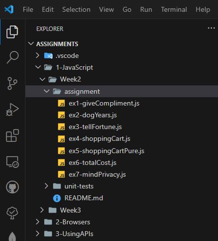
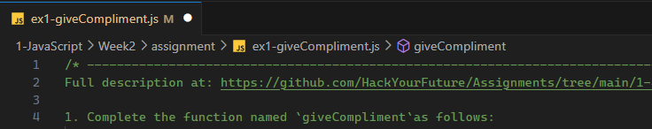
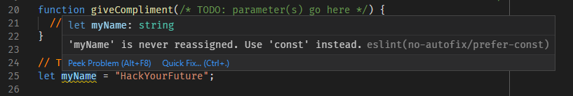
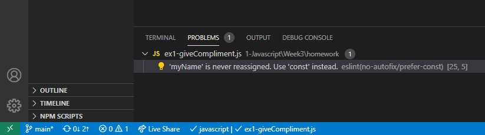
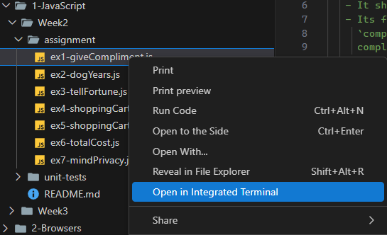
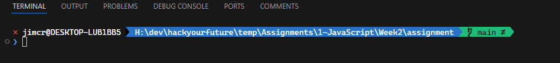

# Homework

This repository contains all of the homework exercises that need to be handed in for the HackYourFuture curriculum.

## Introduction

Throughout your [HYF journey](https://github.com/HackYourFuture/curriculum) you will be asked to do certain homework exercises. This repository contains all of these exercises. The class repository will tell you how to hand in the homework, the curriculum will indicate what week you will need to do.

## Installation

After forking and/or cloning this repository execute the following command from the command line to complete the installation:

```text
npm install
```

This command:

- Installs required software dependencies from the Internet.
- Sets up folders and files used to track your progress.
- Compiles system information and writes the result to `sysinfo.json`. This information can help to track problems with your computer setup when asking others (mentors or students) for (online) help.

## VSCode

You will be spending a lot of time in [VSCode](https://code.visualstudio.com/) while working with this repository. To open it with VSCode you can use the command line:

```text
code homework
```

When you open the repository for the first time you may be invited to install a set of recommended VSCode extensions. These extensions will provide useful help and guidance while you are working files in VSCode. Please install these extensions when invited to do so.

### Overview of the Directory Structure

The directory structure containing the homework for a specific curriculum module (in Figure 1 below, the **JavaScript** module), looks like this:


<br>Figure 1. Directory Structure for the `1-JavaScript` folder.

> A similar directory structure exists for the **Browser** module (`2-Browsers`) and the **Using-APIs** module (`3-Using-APIs`).

Each `homework` folder contains sub-folders and files that make up the exercises. The exercises consist of starter files that you need to complete. Some exercises consist of a single JavaScript (for example, `ex1-giveCompliment.js`). Exercises that are browser-based are mostly contained in sub-folders (for example, `ex1-bookList` in the `1-Browsers/homework` folder).

> You should not change anything in the `test-reports` and `unit-tests` sub-folders. The purpose of these folders will be explained later.

As mentioned, each exercise comes with starter code. Inside the starter code you will find comments that indicate the places where there is something for you to do. For example, in the code of the JavaScript file `ex1-giveCompliment.js` as shown in Figure 2 this is:

1. The **parameter list** (if needed, for you to figure out) of the function `giveCompliment`.
2. The **function body** of `giveCompliment`.
3. The **value** of the variable `myName`.

```js
'use strict';
/* -----------------------------------------------------------------------------
1. Complete the function named `giveCompliment`as follows:
...
------------------------------------------------------------------------------*/
function giveCompliment(/* TODO parameter(s) go here */) {
  // TODO complete this function
}

// TODO substitute your own name for "HackYourFuture"
const myName = 'HackYourFuture';

console.log(giveCompliment(myName));
console.log(giveCompliment(myName));
console.log(giveCompliment(myName));

// ! Do not change or remove the code below
module.exports = giveCompliment;
```

Figure 2. Starter code example: file `ex1-giveCompliment.js`.

In general, you should only change or add code in the places indicated by the `// TODO` comments. You should not delete or rename existing function(s), nor should you change the file names of the starter files. This repository comes with an automated test facility that relies on the presence of these files and functions.

You _are_ allowed to add additional functions and/or global variables (but avoid global variables if you can).

> Note: All JavaScript exercise starter files include a `"use strict"` directive at the top. This will enforce that all variables are declared (with `const` or `'let`, but avoid `var`) before they are used. This is generally considered to be "_best practice_".

When you are in the process of making changes to a file you will notice a dot or bullet appearing after the file name in the tab of the editor window, as shown in Figure 4 below:


<br>Figure 3. Unsaved changes

This indicates that you have unsaved changes. Once you are done, you can use the **File**, **Save** menu commands (or a keyboard shortcut) to save the changes. However, in this repository we have included a setting that automatically saves changes for you whenever you click away from the editor window.

> If you are curious about the VSCode settings that we included in this repo, check the file `settings.json` in the `.vscode` folder. The setting we mentioned in the previous paragraph is: **"files.autoSave": "onFocusChange"**.
>
> You can learn more about VSCode settings here: [User and Workspace Settings](https://code.visualstudio.com/docs/getstarted/settings).

### Prettier VSCode Extension

This is a recommended VSCode extension that we have included in this repo. **Prettier** is an automatic code formatter to make your code look "pretty". However, it is not just that your code is made pretty, it formats your code into a popular standard that has become well established in the JavaScript community. Other developers, whether students, mentors or, later, your colleagues will thank you for using it.

> Ensure that you do not install any other code formatter extensions, for example, **Beautify**, in addition to Prettier. This will cause formatting conflicts.

### ESLint VSCode Extension

Another recommended extension is we have included is **ESLint**. This tool will check your code for _coding style_ errors. Style errors will not necessarily prevent your code from running correctly. However, they indicate that your code does not conform to a preferred coding style. For instance, if you define a variable using the `let` keyword and you do not reassign that variable elsewhere in your code then ESLint will warn you to replace `let` with `const`. In Figure 4 below you can see that the variable name `myName` has a squiggly colored underline. If you hover your mouse over the variable a pop-up window will appear.


<br>Figure 4. ESLint warnings

You can also inspect the **Problems** pane or the left hand size of the VSCode status bar to see whether any problems have been detected, as shown in Figure 5.


<br>Figure 5. VSCode Problems Pane

### Code Spell Checker

A further extension that we have included is a spell checker that understands code. It particularly understands that variable, property and function names are often multi-word names that use **camelCase**, **PascalCase**, **snake_case** or **kebab-case**. When it checks for spelling errors it knows how to break up these multi-word names before checking the broken down words against its dictionary. Spelling mistakes are indicated by squiggly underlines and also reported in the Problems pane.

> Take pride in the correct spelling in your code. It is a sign of professionalism!

## Running the exercises

While working on the exercises you can test-run your code in the usual way, either using the command line (for node-based programs) or by running it in the browser (for browser-based applications). As mentioned earlier, in the **JavaScript** module you will be working with node-based programs.

To run the exercise while in VSCode, first open a VSCode **Integrated Terminal**. You can do so from the VSCode menu, by selecting the **Terminal**, **New Terminal** menu commands, or by using the keyboard shortcut as listed in that menu.

> Tip: for an overview of the keyboard shortcuts available in VSCode, select the **Help**, **Keyboard Shortcut Reference** menu commands. This will open a PDF file in the standard browser, listing all available shortcuts.

The most convenient way to run an exercise from the command line is to use the **exercise runner** included in this repo. Type the following command to run an exercise this way:

```text
npm run it
```

This will lead you through a series of prompts, similar to as shown below, to select the exercise to run:

```text
? Which module? 1-Javascript
? Which week? Week3
? Which exercise? ex1-giveCompliment
Running exercise, please wait...
You are exciting, HackYourFuture!
You are marvelous, HackYourFuture!
You are awesome, HackYourFuture!
```

For node-based programs the console output will be shown in the terminal window. For browser-based application an HTTP server will be started and your web page will opened in the default web browser.

Alternatively you may choose to run the exercise manually. The easiest way for a node-based program is to open a new terminal window directly in the folder that contains your exercise, to right-click its name in the File Explorer pane and select the **Open in Integrated Terminal** option from the context menu, as shown in Figure 6 below.


<br>Figure 6. Open in Integrated Terminal

This will open a terminal window at the bottom of the screen, as show in Figure 7 below (using **PowerShell** in Windows or **bash** or **zsh** in MacOS or Linux):


<br>Figure 7. Terminal Window

Because we used the context menu in the VSCode File Explorer, the current directory in the terminal window is already the `homework` folder containing the exercise. We can execute our program (in this example `ex1-giveCompliment.js`) by typing `node`, followed by a space and then enough characters to uniquely identify the file. Then press the **Tab** key to _expand_ the file name. Because the names of all exercises start with `ex𝑛`, where 𝑛 is a number, it is enough to type just that and press the **Tab** key:

```text
node ex1- (press TAB)
```

This will run the code and any `console.log` statement will print in the terminal window. The unmodified code example will just print:

```text
❯ node .\ex1-giveCompliment.js
undefined
undefined
undefined
```

It is now up to you to complete the code so that it, perhaps, produces something like:

```text
❯ node .\ex1-giveCompliment.js
You are lovely, HackYourFuture!
You are great, HackYourFuture!
You are awesome, HackYourFuture!
```

Once you are satisfied with the results it is time to use the **test runner**, as described next.

> IMPORTANT: it is not recommended to use the test-runner if your code still crashes when run directly. This will just crash the test runner too. You should at least have some running code before trying it with the test runner.

### Automated testing

The repository includes an automated test facility. It serves two purposes.

1. It allows you to test yourself whether your finished exercise meets some important requirements of the assignment. Consider this a form of _early feedback_. Your homework will also be reviewed by a mentor for more thorough feedback later but that make take a while to complete.

2. It allows mentors to gain a quick insight on some key quality benchmarks, giving them a head start in the review process.

> The tests that we have provided here cannot possibly test conformance to every detail of the exercise assignments. Therefore running a successful test is just a first indication of success. Ultimately, it will be the mentor reviewing your homework to give the final verdict.

### Running a test

To run a test, type the following command from the command line:

```text
npm test
```

This guides you through a series of prompts to select an exercise to test, as illustrated in Figure 8 below:

```text
? Which module? 1-Javascript
? Which week? Week3
? Which exercise? ex1-giveCompliment
You have not yet worked on this exercise.
Running test, please wait...

*** Unit Test Error Report ***

- giveCompliment should take a single parameter
- giveCompliment should include a `compliments` array initialized with 10 strings
  No such array found
- giveCompliment should give a random compliment: You are `compliment`, `name`!

No linting errors detected.
No spelling errors detected.
```

Figure 8. Running a test.

The message _You have not yet worked on this exercise_ indicates that this exercise is still unmodified from its original.

#### Unit Test Error Report

Unit tests are software tests that determine whether a particular part of your code produces an expected result. If is it does, it is said to _pass_ the test. If it doesn't, the failing test will be reported in the console.

In the example of Figure 8 there are three such failing unit tests. The messages are hopefully sufficiently informative for you to correct the error(s).

Once you have corrected the error(s), rerun the test to try again.

#### ESLint Report

These are not programming errors but _coding style_ errors. For instance, the unmodified exercise `ex3-tellFortune.js` produces this ESLint error:

```text
ex3-tellFortune.js
  46:10  error  'selectRandomly' is defined but never used  no-unused-vars
```

In this example the error message indicates that a style error was detect in line 46, column 10 of the file `ex3-tellFortune.js`. The variable (or function) `selectRandomly` was defined but never used. Despite this, your code may still run fine.

Style errors do not prevent your code from running correctly. However, leaving them in is simply a bad practice and is a recipe for trouble in the future when other developers attempt to understand and maintain your code.

#### Spell Checker Report

Leaving spelling errors in your code is just plain embarrassing, especially so when there are tools to check for them. Always correct spelling errors, or, if you know the spelling to be correct, add the word to the _workspace dictionary_ in VSCode so that it is not reported again.

If there are no unit-test, style and/or spelling errors then all is well and you should see:

```text
All unit tests passed.
No linting errors detected.
No spelling errors detected.
```

### Test Report Files

When you run a test the results are reported to the console, but also written to a report file in the `test-reports` folder. The name of the report indicates whether the test was successful or not, as shown in Table 1 below.

<!-- prettier-ignore -->
| Name | Status |
| ---- | ------ |
| `<exercise>.todo.txt` | The test for this exercise have not yet been executed or has been executed on unmodified code. |
| `<exercise>.pass.txt` | All unit tests passed and no linting or spelling errors were detected. |
| `<exercise>.fail.txt` | Unit test errors or ESLint or spelling errors were detected. |

Table 1. Test report types

For example:

- `ex1-giveCompliment.todo.txt` _or_
- `ex1-giveCompliment.pass.txt` _or_
- `ex1-giveCompliment.fail.txt`

The report files are considered part of the pull request that you will make to submit your homework. They enable reviewers to get a quick overview of your progress.

In addition, a log of the test results is written to a log file in the root directory of the repository. The name of that file is **\<email>.log**, where \<email> is your email address (or **test-runner.log** if the test runner could not determine your email address).

> **IMPORTANT: You are expected to run all the tests for the current week before submitting a pull request.**
>
> You should strive to complete all tests with no errors reported, however it is okay if for some reason you were unable to fix some error. However, you _**are**_ required to run the tests, whether successful or not.

## Homework Exercise Instructions

### JavaScript Module

- [Week 3](/1-JavaScript/Week3/README.md)
- [Week 4](/1-JavaScript/Week4/README.md)

### Browsers Module

- [Week 1](/2-Browsers/Week1/README.md)

### Using-APIs Module

- [Week 1](/3-UsingAPIs/Week1/README.md)
- [Week 2](/3-UsingAPIs/Week2/README.md)

## Information for mentors

Here you will find some documentation how to write exercises and unit tests.

- [Test Runner](/test-runner/README.md)

## Copyright

_The HackYourFuture curriculum is subject to CC BY copyright. This means you can freely use our materials, but just make sure to give us credit for it_ :).

<a rel="license" href="http://creativecommons.org/licenses/by/4.0/"></a><br />This work is licensed under a <a rel="license" href="http://creativecommons.org/licenses/by/4.0/">Creative Commons Attribution 4.0 International License</a>.
