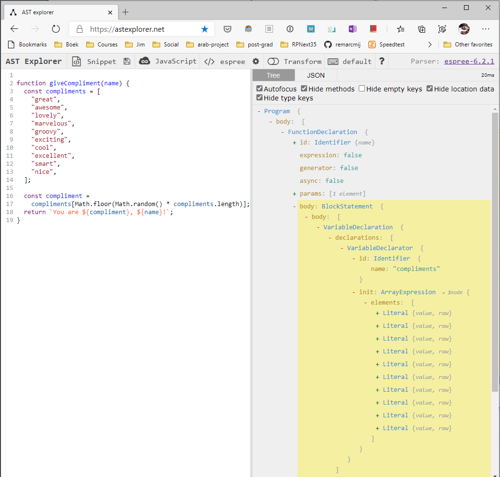

# Test Automation

## Introduction

This repository includes infrastructure for the automatic checking (unit testing, linting and spell-checking) of homework exercises for use by both students and homework reviewers. This document describes the setup of this infrastructure.

## Running the tests

Tests are expected to be executed one at a time. with the command:

```
npm test
```

A test is selected by going through a series of prompts, for instance:

```
? Which module? 1-JavaScript
? Which week? Week3
? Which exercise? ex1-giveCompliment
You have not yet worked on this exercise.
Running test, please wait...

*** Unit Test Error Report ***

- giveCompliment should contain a `const` array named `compliments` with 10 strings
- giveCompliment should give a random compliment: You are `compliment`, `name`!

No linting errors detected.
No spelling errors detected.
```

Analysis:

- The starter code of the exercise has not yet been modified by the student as indicated by the message _You have not yet worked on this exercise_.

- There were two failing unit tests.

- No linting warnings or errors were detected.

- No spelling errors were detected.

### Report files

A report file containing these same messages is written to the corresponding `Week` folder that contains the exercise, in this example that would be the `1-JavaScript/Week3/test-reports` folder. The name of the report file starts with the name of the exercise followed by a suffix that indicates the status of the test:

<!-- prettier-ignore -->
| Name | Status |
| ---- | ------ |
| **_\<exercise>_.todo.txt** | The tests for this exercise have not yet been executed. |
| **_\<exercise>_.pass.txt** | All unit tests passed and no linting errors were detected. |
| **_\<exercise>_.fail.txt** | Unit test errors or linting errors have been detected. |

For example:

- `creditNumberValidator.todo.txt` _or_
- `creditNumberValidator.pass.txt` _or_
- `creditNumberValidator.fail.txt`

These files are mutually exclusive; after running a test any previous report file is erased before a new one is created. However, if a student runs a test against a still untouched exercise the default `.todo.txt` file remains in place.

The report folders are tracked by Git and are part of the pull requests submitted by students. Students are required to run the relevant tests prior to submitting their PR for the current week. Running the tests gives them early feedback on the correctness of the expected results and conformance to the mandated coding style (as per ESLint), and an early opportunity for corrective action. Once submitted as a PR, it also gives pull request reviewers a head start in gaining insight in the correctness of the homework, although manual inspection is of course still required.

### Test log file

Test results along with other events are also logged in a `<email>.log` file in the root of the project folder, where `<email>` is the user's Git email address. This log file is tracked in Git and can be used by students and mentor to review the testing history.

## Directory Structure

The test runner relies on strict adherence to a predefined naming convention and directory structure as detailed in the table below.

<!-- prettier-ignore -->
Folder | Description |
------ | ----------- |
**_\<module>_/Week𝑛/homework**| Example: `1-JavaScript/Week3/homework`<br><br>The JavaScript file representing the exercise must named `<exercise-name>.js` and placed in this folder. However, if the exercise consists of multiple files (e.g. a browser-based exercise) then these files must be placed in a _folder_ named `<exercise-name>`.<br><br>There can be multiple exercises per _Week𝑛_ folder.
**_\<module>_/Week𝑛/unit-tests** | This folder contains the unit test JavaScript files. The JavaScript file containing the unit test(s) for ab exercise must named `<exercise-name>.test.js`.

## Linting

ESLint rules are configured as usual in the file `.eslintrc.js`. It is possible to define a hierarchy of `.eslintrc.js` files if certain exercise require custom ESLint rules. See also [ESLint: Configuration Cascading and Hierarchy](https://eslint.org/docs/user-guide/configuring#configuration-cascading-and-hierarchy).

## Postinstall Script

A number of folders and files are automatically created by means of a `postinstall` script in `package.json`. This script is run after `npm install` has completed installing the dependencies defined in `package.json`.

In each _Week𝑛_ folder a subfolder `test-reports` is created. Inside each `test-reports` folder one or more `.todo.txt` report files are created, one for each test of the corresponding week. The resulting structure thus looks like this:

```
1-JavaScript/
  Week3/
    homework/
      creditNumberValidator.js
    test-reports/
      creditNumberValidator.todo.txt
    unit-tests/
      creditNumberValidator.test.js
```

Furthermore, a file `.hashes.json` is created in the `test-automation` folder that contains a JSON object with hashes computed over of the `.js` file(s) of the exercises, one hash per exercise. This information is used to detect whether the starter code of the exercise has been modified since initial installation. Note that `.hashes.json` is not tracked by Git (it is listed in `.gitignore`).

## Cleanup

The `postinstall` script must be run before committing changes to the master repo to ensure that all test reports are restored to the default `.todo.txt` files and the log file, if present, is cleaned up:

```
npm run postinstall
```

## Exercises and Unit Tests

Simple _Node_-based exercises, consisting of a single JavaScript file should include a `module.exports` object at the bottom of the file that exports a function that represents the exercise. For example:

```js
function doubleEvenNumbers(numbers) {
  // TODO: rewrite the function body using `map` and `filter`.
}

// ! Do not change or remove the code below
module.exports = doubleEvenNumbers;
```

The corresponding unit test can `require` this function in order to test it. Because many exercises in the JavaScript module include calls to `console.log` that we do not want to show up when running a test, the `require` is done dynamically with `console.log` being mocked for the duration of the `require`. This is done through the helper function `beforeAllHelper` in `unit-test-helper.js`. This function also reads the exercise file as text and (optionally) build an AST (Abstract Syntax Tree) to enable code analysis.

```js
describe("doubleEvenNumbers", () => {
  let doubleEvenNumbers;
  const state = {};

  beforeAll(() => {
    const { exports, rootNode } = beforeAllHelper(__filename, {
      parse: true,
    });
    doubleEvenNumbers = exports;

    // ...
  });

  // ...
});
```

### Code Analysis

More sophisticated unit test can use code analysis to inspect the actual code of the exported function. For instance, for the `doubleEvenNumber` exercise the `for` loop from the existing (working) code should be replaced with `map` and `filter`. There no way to check this from the runtime context. Here, code analysis can come to the rescue.

First of all (and this goes for exercises to be unit-tested), we must have a working model solution to analyze. For instance:

```js
function doubleEvenNumbers(numbers) {
  return numbers.filter((num) => num % 2 === 0).map((num) => num * 2);
}
```

We can use the online [AST Explorer](https://astexplorer.net/) to examine the AST of a model solution. This is illustrated in Figure 1 below. The AST tree is actually a large, hierarchical JavaScript/JSON object that consist of (_ESTree_) "nodes".

> See [ESTree Spec](https://github.com/estree/estree). Of most interest are [es5.ms](https://github.com/estree/estree/blob/master/es5.md) and [es2015.md](https://github.com/estree/estree/blob/master/es2015.md).

By expanding and examining the nodes in the AST we can see that we should expect `MemberExpression` nodes with `property.name` of `"map"` and `"filter"` respectively. With this knowledge we can now write some code to "walk" the AST, looking for these `MemberExpression` nodes. (The actual code for this unit test also checks wether `map` and `filter` are used _within_ the scope of `doubleEvenNumbers`.)

```js
// ...
let rootNode;
const state = {};

beforeAll(() => {
  let exports;
  ({ exports, rootNode } = beforeAllHelper(__filename, {
    parse: true,
  }));
  doubleEvenNumbers = exports;

  // Look for `map` and `filter` calls inside the
  // scope of the `doubleEvenNumber` function
  walk.simple(rootNode, {
    MemberExpression({ property }, ancestors) {
      if (["map", "filter"].includes(property.name)) {
        state[property.name] = true;
      }
    },
  });
});
```

We can now write simple unit tests to check for the mandated existence of `map` and `filter`:

```js
it("should use `map`", () => {
  expect(state.map).toBeDefined();
});

it("should use `filter`", () => {
  expect(state.filter).toBeDefined();
});
```

This completes the code analysis for this exercise example.


Figure 1: AST (Abstract Syntax Tree) of the function `doubleEvenNumbers`.
