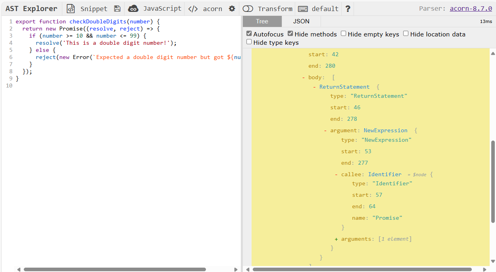

# Test Automation

## Introduction

This repository includes infrastructure for the automatic checking (unit testing, linting and spell-checking) of homework assignments, for use by both trainees and homework reviewers. This document describes this infrastructure.

## Running the tests

Tests are expected to be executed one at a time, with the command:

```text
npm test
```

A test is selected by going through a series of prompts, for instance:

```text
? Which module? 1-JavaScript
? Which week? Week2
? Which exercise? ex1-giveCompliment
Running test, please wait...
*** Unit Test Error Report ***

 PASS  .dist/1-JavaScript/Week2/unit-tests/ex1-giveCompliment.test.js
  js-wk2-ex1-giveCompliment
    ✅ should exist and be executable (1 ms)
    ✅ should have all TODO comments removed
    ✅ `giveCompliment` should not contain unneeded console.log calls
    ✅ should take a single parameter
    ✅ should include a `compliments` array inside its function body
    ✅ the `compliments` array should be initialized with 10 strings (1 ms)
    ✅ should give a random compliment: You are `compliment`, `name`!

Test Suites: 1 passed, 1 total
Tests:       7 passed, 7 total
Snapshots:   0 total
Time:        0.29 s, estimated 1 s
Ran all test suites matching /\/home\/jim\/dev\/hackyourfuture\/Assignments\/.dist\/1-JavaScript\/Week2\/unit-tests\/ex1-giveCompliment.test.js/i.
No linting errors detected.
No spelling errors detected.
```

### Report file

When you run a test the results are reported to the console, but also written to a report file named `<exercise-name>.report.txt`, in a `test-reports` folder for each week.

Trainees are expected to include the test reports in their pull request for the benefit of the assignment reviewer.

Trainees are expected to run the relevant tests. Running a test gives them early feedback on the correctness of the expected results and on conformance to the mandated coding style (as per ESLint). This provides them an early opportunity for corrective action. Once submitted as part of a PR, the report files give pull request reviewers some key indicators into the correctness of the homework while doing a more elaborate visual inspection of the actual code.

## Directory Structure

The test runner relies on strict adherence to a predefined naming convention and directory structure as detailed in the table below.

<!-- prettier-ignore -->
| Folder | Description |
| ------ | ----------- |
| `<module>/Week𝑛/assignment` | Example: `1-JavaScript/Week3/assignment`<br><br>The JavaScript file representing the exercise must named `<exercise-name>.js` and placed in this folder. However, if the exercise consists of multiple files (e.g. a browser-based exercise) then these files must be placed in a _folder_ named `<exercise-name>`. In this case, the main JavaScript file must be called `index.js`.<br><br>There can be multiple exercises per _Week𝑛_ folder. |
| `<module>/Week𝑛/unit-tests` | This folder contains the unit test (JavaScript or TypeScript) files. The JavaScript/TypeScript file containing the unit test(s) for an exercise must named `<exercise-name>.test.[jt]s`. Unit test files are optional. If not provided, the unit test step of the test runner is skipped.<br><br>Note that TypeScript unit tests are transpiled to JavaScript to a `.dist` folder in the project root, using an `npm postinstall` script. |

## Linting

ESLint rules are configured as usual in the file `.eslintrc.js`. Should this be needed, it is possible to define a hierarchy of `.eslintrc.js` files if certain exercise require custom ESLint rules. See also [ESLint: Configuration Cascading and Hierarchy](https://eslint.org/docs/user-guide/configuring#configuration-cascading-and-hierarchy).

## npm `postinstall` script

An npm `postinstall` script is automatically executed as part of the `npm install` process. This script simply transpiles all TypeScript files to the `.dist` folder.

## `npm run seal`

This script scans the directory structure of the repository for `assignment` folders and globs into them to collect file and folder names of exercises they contain. For each exercise it computes a hash over its file(s). The results are recorded in the file `exercises.json`. The test runner uses this file to drive its prompt menu and to establish whether exercises have been modified from their "sealed" (pristine) state, i.e. if a newly computed hash over the exercises file(s) differ from the stored hash.

## `npm run clean`

This script cleans out the `test-report` folders and removes the `TEST_SUMMARY.md` file.

Furthermore, a file `.exercises.json` is created in the root folder that contains a JSON object with hashes computed over of the `.js` file(s) of the exercises, one hash per exercise. This information is used to detect whether the starter code of and exercise has been modified since initial installation.

To prevent trainees from accidentally running this script the `ENABLE_CLEANUP` environment variable must be set to "true" (see `.env-example`).

After running the `setup` script the resulting structure for a module looks similar to this:

## Exercises and Unit Tests

The repo is ECMAScript module based throughout. Simple _Node_-based exercises, consisting of a single JavaScript file, should `export` the function to be tested. For example:

```js
export function checkDoubleDigits(/* TODO add parameter(s) here */) {
  // TODO complete this function
}
```

The corresponding unit test can dynamically import this function in order to test it. Because many exercises include code that is executed immediately when the file is imported `console.log`, `setTimeout`, `setInterval` and `Math.random` are mocked to no-ops. This is done through the helper function `beforeAllHelper` in `unit-test-helper.js`. This function also reads the exercise file as text and (optionally) builds an AST (Abstract Syntax Tree) to enable static code analysis.

```ts
describe('api-wk1-ex2-checkDoubleDigits', () => {
  const state: State = {};

  let exInfo: ExerciseInfo;

  let checkDoubleDigits: (num: number) => Promise<string>;

  beforeAll(async () => {
    exInfo = await beforeAllHelper(__filename);

    checkDoubleDigits = exInfo.module?.checkDoubleDigits;
    // ...
  });

  // ...
});
```

### Static Code Analysis

More sophisticated unit test can use static code analysis to inspect the actual code of the exported function. For instance, in the `checkDoubleDigits` exercise we expect a new `Promise` to be created and `resolve()` and `reject()` to be called with a single parameter each. There no way to check this from the runtime context. Here, static code analysis can come to the rescue.

First of all (and this goes for exercises to be unit-tested), we must have a working model solution to analyze. For instance:

```js
export function checkDoubleDigits(number) {
  return new Promise((resolve, reject) => {
    if (number >= 10 && number <= 99) {
      resolve('This is a double digit number!');
    } else {
      reject(new Error(`Expected a double digit number but got ${number}`));
    }
  });
}
```

We can use the online [AST Explorer](https://astexplorer.net/) to examine the AST of a model solution. This is illustrated in Figure 1 below. The AST tree is actually a large, hierarchical JavaScript/JSON object that consist of **ESTree** "nodes".

> See [ESTree Spec](https://github.com/estree/estree). Of most interest are [es5.ms](https://github.com/estree/estree/blob/master/es5.md) and [es2015.md](https://github.com/estree/estree/blob/master/es2015.md).

By expanding and examining the nodes in the AST we can see that we can expect `NewExpression` node with a `callee.name` of `"Promise"`. Descending further down this node we can find two `CallExpression` nodes, with `callee.name` properties of respectively `resolve` and `reject`, each with an `argument` array of length 1.

The callback function passed to `beforeHelper` walks down the AST tree using the `simple()` function imported from `acorn-walk`. This function visits each node in the AST tree and will call a handler for each node if present in the object passed as its second parameter. We simply record facts of interest in a `state` object than we can subsequently inspect in individual `test()` functions.

```js
// ...
type State = {
  newPromise?: boolean;
  resolve?: number;
  reject?: number;
  [key: string]: any;
};

describe('api-wk1-ex2-checkDoubleDigits', () => {
  const state: State = {};

  let exInfo: ExerciseInfo;

  let checkDoubleDigits: (num: number) => Promise<string>;

  beforeAll(async () => {
    exInfo = await beforeAllHelper(__filename);

    checkDoubleDigits = exInfo.module?.checkDoubleDigits;

    exInfo.rootNode &&
      simple(exInfo.rootNode, {
        NewExpression({ callee }) {
          if (callee.type === 'Identifier' && callee.name === 'Promise') {
            state.newPromise = true;
          }
        },
        CallExpression({ callee, arguments: args }) {
          if (
            callee.type === 'Identifier' &&
            ['resolve', 'reject'].includes(callee.name)
          ) {
            state[callee.name] = args.length;
          }
        },
      });
  });

  test('should call new Promise()', () => {
    expect(state.newPromise).toBeDefined();
  });

  test('`resolve()` should be called with a one argument', () => {
    expect(state.resolve).toBe(1);
  });

  test('`reject()` should be called with a one argument', () => {
    expect(state.reject).toBe(1);
  });

```


Figure 1: AST (Abstract Syntax Tree) of the function `checkDoubleDigits`.

## Adding new exercises

To add a new exercise the following is needed:

1. A starter JavaScript file for a node-based exercise or an `index.html` and `index.js` file for a browser-based exercise.
2. An exercise section to be added to the README of the relevant Week folder.
3. An optional unit test file.

All files and folders should adhere to the naming conventions as described earlier in this document.

## Before Committing Changes

Use the `npm run clean` command before committing changes to the repo. This will clear up any test reports and (re-)generate the exercise hashes.
